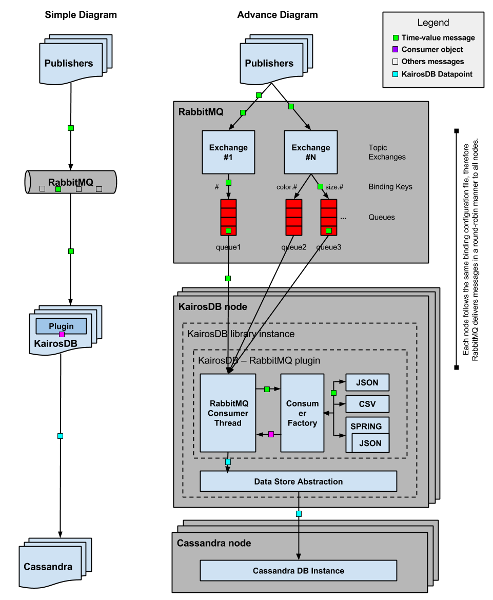
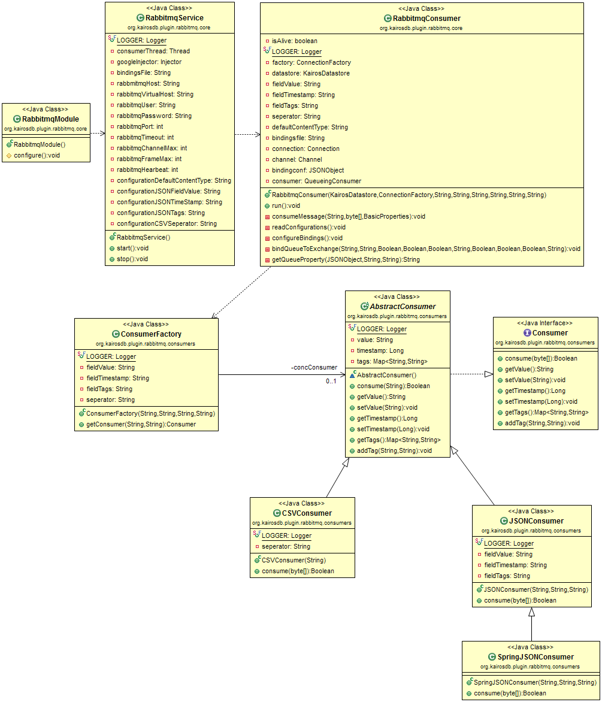

# KairosDB – RabbitMQ plugin

KairosDB-RabbitMQ is an scalable-ready ad-hoc plugin for the KairosDB time series database that subscribes to RabbitMQ topic exchanges and automatically saves designated time series messages in KairosDB. This plugin is ideal for a cloud environment to avoid the latency, maintenance and resources of an extra middleware system to transfer messages between RabbitMQ and KairosDB clusters. In addition, each KairosDB instance with this plugin follows the same binding configuration and thus, when the KairosDB cluster scales horizontally, the load is distributed in a round-robin manner per each plugin instance without creating extra queues in the RabbitMQ cluster.

----------

## Usage ##

### 1. KairosDB ###

This is a plugin for KairosDB, so obviously you should first obtain KairosDB before using this plugin.

Follow the instructions on their documentation to install KairosDB.

https://code.google.com/p/kairosdb/wiki/GettingStarted

### 2. Install ###

1. Navigate to the location of where you want to have this plugin stored, using the console of your OS.

2. Clone this project to your desktop, using the git clone command:

    git clone https://github.com/...

### 3. Configuration ###

KairosDB-RabbitMQ needs to know a few things to operate properly.

#### Plugin configuration ###

Edit the file ```/dist/conf/kairosdb-rabbitmq.properties```

 - Configure the connection to your RabbitMQ broker. E.g.:

```
kairosdb.plugin.rabbitmq.host = localhost
kairosdb.plugin.rabbitmq.virtualhost = /
kairosdb.plugin.rabbitmq.username = guest
kairosdb.plugin.rabbitmq.password = guest
kairosdb.plugin.rabbitmq.port = -1
kairosdb.plugin.rabbitmq.connectionTimeout = 0
kairosdb.plugin.rabbitmq.requestedChannelMax = 0
kairosdb.plugin.rabbitmq.requestedFrameMax = 0
kairosdb.plugin.rabbitmq.requestedHeartbeat = 0
```

 - Configure the format of your messages, specifying the characteristics of your messages. By default, the plugin is ready to handle JSON and CSV messages. So, for example, for JSON messages, you have to specify what’s the field name for *value*, *timestamp* and *tags*. For CSV messages, you just have to specify what’s the *separator* for the columns.

Note: if your message does not contain a JSONArray for the *tags*, the consumer will treat each field of your JSON messages, beside the ones for *value* and *timestamp*, as *tags*.

###### Example

E.g. for JSON messages with a format like this:

    {"tags":[{"unit":"cm"},{"timezone":"Europe/Madrid"},{"collectedtimestamp":"1388530860000"}],"value":10,"sourceTimestamp":1388530800000}

or

    {"unit":"cm","timezone":"Europe/Madrid","collectedtimestamp":"1388530860000","value":10,"sourceTimestamp":1388530800000}

You should have your configuration as:

    #KairosDB-RabbitMQ message formats
    #the message format to use in case the message has no ContentType defined
    kairosdb.plugin.rabbitmq.defaultContentType = JSON
    #JSON messages
    #name of the field for value
    kairosdb.plugin.rabbitmq.jsonfield.value = value
    #name of the field for timestamp
    kairosdb.plugin.rabbitmq.jsonfield.timestamp = sourceTimestamp
    #name of the JSONArray field for tags
    kairosdb.plugin.rabbitmq.jsonfield.tags = tags
    #if message does not contain this JSONArray field use the rest of the root properties as tags
	
###### Example

E.g. for CSV/TEXT messages with a format like this:

    1388530800000,10,unit,cm,timezone,Europe/Berlin,collectedtimestamp,1388530860000

You should have your configuration as:

```
#CSV/Text messages
kairosdb.plugin.rabbitmq.csv.seperator = ,
```

#### Binding configuration ###

Edit the file ```/dist/conf/bindings.json```

 - Next you need to define the bindings with your RabbitMQ broker. The plugin needs to know where, what and how to subscribe to your message broker. Thus, you must define which topic *exchange*’s you want to subscribe to and which *queueName*’s are bound to them, according to your *bindingKey*’s. Read the documentation for the [RabbitMQ AMQP model](https://www.rabbitmq.com/tutorials/amqp-concepts.html) for more information. 

###### Example
 
E.g. let's imagine you want to have these queues:

```
"queues": [
        {
            "queueName": "queue1",
            "queueDurable": "true",
            "queueExclusive": "false",
            "queueAutoDelete": "false"
        },
        {
            "queueName": "queue2",
            "queueDurable": "true",
            "queueExclusive": "false",
            "queueAutoDelete": "false"
        },
        {
            "queueName": "queue3",
            "queueDurable": "true",
            "queueExclusive": "false",
            "queueAutoDelete": "false"
        }
    ]
```
And have the following bindings:

1. Subscribe to exchange **exch1** and subscribe to all messages, i.e., using *Binding Key* as **#**, queueing the messages in queue **queue1**.

2. Subscribe to exchange **exch2** and subscribe to messages with a *Routing Key* starting with **color.** , i.e., using *Binding Key* as **color.#**, queueing the messages in queue **queue2**.

3. Subscribe to exchange **exch2** and subscribe to messages with a *Routing Key* starting with **size.** , i.e., using *Binding Key* as **size.#**, queueing the messages in queue **queue3**.

Then you must have a binding configuration as this:

```
"bindings": [
        {
            "exchange": "exch1",
            "exchangeType": "topic",
            "exchangeDurable" : "true",
            "exchangeAutoDelete" : "false",
            "exchangeInternal" : "false",
            "binds": [
                {
                    "bindingkey": "#",
                    "queueName": "queue1"
                }
            ]
        },
        {
            "exchange": "exch2",
            "exchangeType": "topic",
            "exchangeDurable" : "true",
            "exchangeAutoDelete" : "false",
            "exchangeInternal" : "false",
            "binds": [
                {
                    "bindingkey": "color.#",
                    "queueName": "queue2"
                },
                {
                    "bindingkey": "size.#",
                    "queueName": "queue3"
                }
            ]
        }
    ]
```

### 4. Deploy ###

#### Manually ####

Copy the contents of ``dist/`` to the root location of your KairosDB, respectively:

``KairosDB-RabbitMQ/dist/conf/`` to ``YourKairosDB/conf/``

``KairosDB-RabbitMQ/dist/lib/`` to ``YourKairosDB/lib/``
 
#### Ant ####

If you intend to do some modifications to the plugin or automate the deployment process, you can use the Ant target rules inside the ``build.xml`` file to deploy the necessary files in KairosDB folder. Here are the instructions:

1. Define the ``kairosdb.local.dir`` property with the location of your KairosDB instance. E.g.:

`<property name="kairosdb.local.dir" value="C:\Users\JohnDoe\workspace\kairosdb-local" />`

2. Run the ``dist-local`` Ant target to deploy the files into the previously defined location.

`ant dist-local`    

----------

## Documentation ##

### KairosDB DataPoints ###

The fundamental operation of this plugin is to push time series data from RabbitMQ to KairosDB. Hence, the information saved depends on the content of each message. For that, the plugin needs to know what and where to read these messages and match them to KairosDB system. First, the ‘bindings.json’ configuration file defines where to read these messages. Then, for each message, based on its Content Type, the plugin will interpret the message and read the necessary data, following the ´kairosdb-rabbitmq.properties’ configuration files. Finally, data are saved in a KairosDB metric, named after the Routing Key of the message.

In sum, to push time series data a.k.a. data points to KairosDB using this plugin you must provide:

1. Routing Key for each RMQ Message <-> Used as Metric Name in KairosDB
2. Content Type for each RMQ Message <-> Decides which consumer to be use (JSON, CVS, etc.)
3. TimeStamp inside the payload of each RMQ Message (Long, Milliseconds since 1/1/1970 UTC) <-> Time Stamp of the new Data Point
4. Value inside the payload of each RMQ Message (Long or Double, e.g., 523 or 132.45) <-> Value of the new Data Point

Optionally you can provide:

1. A list of tags inside the payload of each RMQ Message (tag is a pair of elements) <-> Tags of the new Data Point

For more information consult the KairosDB documentation
https://code.google.com/p/kairosdb/wiki/AddDataPoints

###### Example

Eg. Let’s imagine we want to push these RMQ time series data to KairosDB:

**Queued message inside RMQ:**

```
Rounting Key:
size.h1.title

Properties: 
content_type = application/json

PayLoad:
{"tags":[{"unit":"cm"},{"timezone":"Europe/Madrid"},{"collectedtimestamp":"1388530860000"}],"value":10,"sourceTimestamp":1388530800000}
```

**This will be consumed as:**

```
Metric Name:
size.h1.title

Consumer:
Class = JSONConsumer.java
Properties in use = kairosdb.plugin.rabbitmq.jsonfield.value, kairosdb.plugin.rabbitmq.jsonfield.timestamp, kairosdb.plugin.rabbitmq.jsonfield.tags

Saved as:
(put <metric name> <time stamp> <value> <tag> <tag>... /n)
put size.h1.title 1388530800000 10 unit cm timezone Europe/Madrid collectedtimestamp 1388530860000
```

### RabbitMQ Messages ###

The plugin starts in the background, in a separate thread, as soon as KairosDB starts. From then it stays listening for messages indefinitely, according to your binding configuration. Since it subscribe to these messages automatically, it needs to know how to handle and read these messages to collect its *value*, *timestamp* and *tags* to be saved in yours KairosDB.

Out of the box, KairosDB-RabbitMQ comes ready to handle these types of messages:

#### JSON Messages #####

In case you want to subscribe to JSON messages, the *content_type* property of each message should contain the keyword *json* and it must follow one the following formats (no particularly order):

```
{
    "<kairosdb.plugin.rabbitmq.jsonfield.tags>": [
        {
            "<tag key>": "<tag value>"
        },
        {
            "<tag key>": "<tag value>"
        },
        ...
    ],
    "<kairosdb.plugin.rabbitmq.jsonfield.value>": "<Value (either a Long (eg. 10) or a Double (eg. 10.0))>",
    "<kairosdb.plugin.rabbitmq.jsonfield.timestamp>": "<Timestamp (milliseconds)>"
}
```

or

```
{
    "<kairosdb.plugin.rabbitmq.jsonfield.value>": "<Value (either a Long (eg. 10) or a Double (eg. 10.0))>",
    "<kairosdb.plugin.rabbitmq.jsonfield.timestamp>": "<Timestamp (milliseconds)>",
    "<tag.key>": "<tag.value>",
    "<tag.key>": "<tag.value>",
    ...
}
```

#### CSV/TEXT Messages #####

In case you want to subscribe to CSV or any Text messages, the *content_type* property of each message should contain the keyword *csv*, *text* or *txt* and you need to follow this format:

```<Timestamp (milliseconds)>{sep}<Value (either a Long (eg. 10) or a Double (eg. 10.0))>{sep}<tag key>{sep}<tag value>{sep}<tag key>{sep}<tag value>{sep}...```

Notes: 
1. *{sep}* is the String defined in the ``kairosdb.plugin.rabbitmq.csv.seperator`` property.
2. In case you are using *Double*'s, make sure that your decimal seperator is not equal to ``kairosdb.plugin.rabbitmq.csv.seperator`` property.

#### Spring AMQP / JSON Messages #####

In case you are using the Spring AMQP project, the KairosDB-RabbitMQ plugin is ready to read those messages, using  *content_type* as *application/octet-stream*.

Since the Spring AMQP framework encapsulates your messages in Java *Message* objects, these have to be decoded before reading its content. Upon receiving these messages, the plugin cast them to *Message* objects and extract their body.

For now, their content must be JSON. Further work involves having the possibility to subscribe to these messages, but treat them not only as JSON messages, but also as CSV/TEXT messages per example.

### Conceptual Architecture ###



### Software Architecture ###

